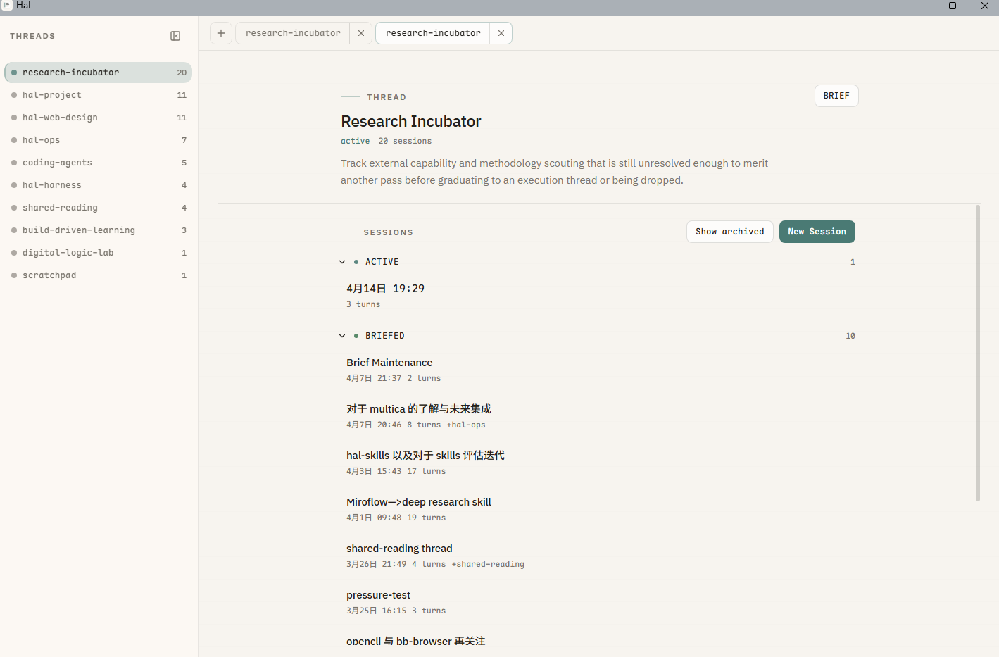

# HaL

> A long-running collaboration workspace, not a chatbot.
> Human defines direction; AI advances the work; files and events keep state.

HaL（Human and L）是一个面向长期人机协作的工作台。它从“个人助理 agent”
的设想出发，逐步演化为 *shared cognitive workspace*：人定义方向与边界，
AI 推进、组织、记录并沉淀证据，整个协作过程通过文件与事件保持可检查、
可迁移、可重建。

它不是又一个 chatbot，也不是又一个写代码的 IDE 插件。HaL 关心的是：
**当人和 AI 长期合作做一件事时，状态应该长在哪里、证据应该长成什么样、
模型实际看到的上下文应该如何被回放和审计。**

---

## Why HaL

主流 AI 对话产品默认形态有两个隐含假设：

1. 协作以一次次的对话为单位，结束就丢；
2. 上下文是把历史尽量塞进 prompt。

这两个假设在长期任务里很快崩溃：

- 每次开新会话都要重新介绍背景；
- 重要决策散落在某个聊天记录里，下次找不到；
- 模型实际看到的上下文不可回放，问题难定位；
- 工具调用、提醒、思考片段混杂在自然语言里，缺乏结构。

HaL 用一组明确的不变式（invariants）来回应这些问题。

---

## Invariants

HaL 在演化中坚持三条不变式：

### 1. Thread is the unit of collaboration

工作以 **thread** 为单位推进。一个 thread 承载一个长期关注点（一个项目、
一段学习、一个反复出现的协调话题），跨越多个 session 与时间。
**连续性来自 thread 状态，不是历史回放。**

### 2. Files are state, events are evidence

- 重要状态住在文件和目录里：`THREAD.yaml`、`BRIEF.md`、`refs/sessions.jsonl`。
- 运行过程进入 append-only 的事件日志（`working-log.jsonl`）。
- 任何重要的东西都应当能从文件系统和事件流重建。

上下文是从当前状态 *编译* 出来的，不是从原始聊天记录里召回的。
目标不是“记住一切”，而是“维持正确的工作集”。

### 3. Human defines direction, AI advances the work

human-in-the-loop 不可妥协。人定目标、边界、触发点；AI 在边界内执行、
组织、提炼。**clear bounds 内的高自治，不接管方向。**

---

## Concepts at a glance

| Concept     | Role |
|-------------|------|
| **Thread**  | 长期协作容器，承载一个持续关注点 |
| **Session** | 一次专注工作，挂载在 thread 上，产出可沉淀证据 |
| **Turn**    | 原子协作循环：human input → engine → response |
| **Event**   | turn 上的颗粒度证据（durable / transient） |
| **Episode** | 一个 session 对 thread 的不可变贡献 |
| **Brief**   | 一个 thread 当前状态的合成视图（`BRIEF.md`） |

Session lifecycle：

```
human creates session (selects primary thread + mounted threads)
  ├── turn 1 → turn N: events emitted to working-log.jsonl
  └── human ends session:
      ├── /brief → episode created → BRIEF.md updated
      └── /drop  → session dropped, no sedimentation
```

---

## What it looks like

HaL 的默认界面不是聊天流，而是 **working log + thread surface + BRIEF**。

工作日志（assistant 文本走页面正文，user 文本用浅约束容器，工具/系统行
作为次级 chrome，证据是显式约束的卡片）：



Thread 详情页（thread 的 BRIEF、episodes、refs/sessions 一览，作为长期
重新进入任务的入口）：


> 设计目标：UI 不应再增加更多工具，而应让长期协作过程本身**可观测、
> 可沉淀、可重建**。

---

## Design highlights

### Session-first runtime

`session_id` 是引擎的唯一身份键；transport 路由（`channel:chat_id`）只是
薄适配层。Native web 直连引擎 session lifecycle，不走 channel adapter。

### Context compiled fresh every turn

挂载关系（mounted threads）是显式且可中途修改的；context（BRIEF、memory、
dynamic scope）每个 turn 重新编译——**没有冻结的 baseline。**

### Durable vs transient events

每个 session 拥有单调递增的 `SessionEventPublisher`，事件结构：

```
{ v, seq, ts, session_id, turn_id, type, actor, refs, payload }
```

- **Durable** 事件持久化到 `working-log.jsonl`，足以重建会话 UI 与 brief worker 输入。
- **Transient** 事件（token streaming、progress）只走实时连接。

### Message injects are first-class

非自然对话输入——thread snapshot、turn context、runtime reminder、
user follow-up——一旦进入模型 prompt，就以结构化形式写进 working-log，
保证模型实际看到的上下文 **可回放、可审计**。

详见 [`docs/specs/message-injects.md`](docs/specs/message-injects.md)。

### Storage layout

```
~/.hal/
  work/
    threads/{slug}/         BRIEF.md, THREAD.yaml, episodes/, refs/sessions.jsonl
    sessions/{session_id}/  manifest.json, working-log.jsonl
  runtime/
    resume/                 Engine checkpoints
    logs/                   Operational logs
    metrics/                Context metrics
```

Sessions 与 threads 通过 `refs/sessions.jsonl` 链接，不靠物理嵌套。

---

## Repository layout

```
hal/                Python runtime
├── runtime/        engine, subagent, loop, session, brief, bootstrap
├── context/        per-turn context compilation
├── domain/         Thread / Session / Turn / Episode / Brief
├── memory/         long-term recall
├── workspace/      ~/.hal/* contracts
├── capabilities/   tools / skills
├── channels/       IM adapters (e.g. Telegram)
├── infra/          providers, config, storage
└── cli/            Typer command package

web/                Native web client (React + TS)
docs/specs/         design system, thread system, message injects, ...
tests/              mirrored test layout
```

Frontend 入口：[`docs/specs/design-system.md`](docs/specs/design-system.md)。
Backend 不变式：[`DESIGN.md`](DESIGN.md)。

---

## Status

HaL 目前是单人长期实验项目，主要面向以下三类协作：

- 跨多个 session 的项目推进与决策沉淀
- 长期学习 / 兴趣方向的持续讨论
- 个人助理型任务（提醒、整理、跨 channel 协作）

它仍在演化中，不承诺接口稳定，也不追求成为通用 chatbot。设计上更接近
一个**可被自己长期使用的工作台 + 一组关于人机协作的明确选择**。

---

## Further reading

- [`DESIGN.md`](DESIGN.md) — 不变式与协作架构
- [`docs/specs/thread-system.md`](docs/specs/thread-system.md) — Thread 语义、BRIEF 契约
- [`docs/specs/message-injects.md`](docs/specs/message-injects.md) — 注入消息的可回放契约
- [`docs/specs/workspace-layout.md`](docs/specs/workspace-layout.md) — `~/.hal/` 工作区契约
- [`docs/specs/design-system.md`](docs/specs/design-system.md) — 前端设计系统入口
